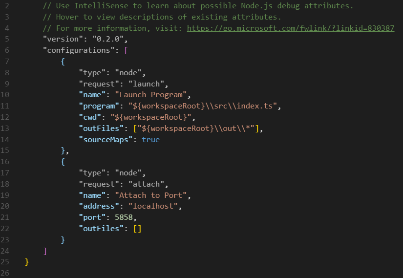

# Typescript backend with Node.js & Express
In this project, we’re going to build a simple [Node.js](https://nodejs.org/en/) server with [Express](http://expressjs.com/), a javascript framework to manage Http requests and responses, but with the difference that we are not building it on plain javascript, we are going to develop it in typescript and serve the transpiled result.

## Initializing
There are two ways of starting a Node.js project from scratch or cloning an existing one:

a) Scratch:

If you choose this way, first of all you have to create your project folder and move into, once into, initialize the project as a git repository and add a remote branch:
```shell
$ mkdir express-sample
$ cd express-sample\
$ git init 
$ git remote add origin https://github.com/<github_user>/express-sample.git
```
Once initialized as a git repository, we should initialize the repository as a javascript package with:
```shell
$ npm init
```
This command will create a ```package.json```, the function of this file will be principally specify the dependencies of our project, because the final purpose of our project is to be a functional server not to publish it as an npm package.
Next is to create our ```tsconfig.json```, this file will pass default options to the transpiler every time you transpile your .ts files, for doing that execute following command:
```shell
$ tsc --init
```
Once created, we will add our output directory, update the EcmaScript target and add some options to help us in the development (for more information about the compiler options visit the [Typescript](http://www.typescriptlang.org/docs/handbook/compiler-options.html) web page).  Also we gonna add a property include with the directory which will contain our source code, but first we have to create it with:
```shell
$ mkdir src
```
Being the actual ```tsconfig.json``` something like this:


Be careful with the options displayed in the image, because to use the strict compiler flag, your typescript version should be at least 2.3.0.

Finally, we gonna add a script to build our javascript files, adding the next line inside the scripts property in the ```package.json```:
```javascript
"build": "tsc"
```
This will permit us to transpile the typescript files with the command:
```shell
$ npm run build
```
b) Clone:

If you aren’t starting a project, but you’re contributing to another one, you only have to execute the following commands:
```shell
$ git clone https://github.com/<github_user>/express-sample.git
$ cd express-sample\
$ npm install
```
The last one is the most important, which gonna install all the dependencies for your project, and if you’re working in a collaborative project, maybe you should execute this command when you do a git pull and your project fails, before execute someone else.

## Install Express 
First of all, we must install the framework in our directory and add it to the ```package.json``` dependencies, for that we gonna use the command:
```shell
$ npm install express --save
```
Later, we are gonna create an ```index.ts``` and import the our project using the import reserved word something like this:
```javascript
import * as express from 'express'
```
You can notice at this moment that the import fail, that’s because the express framework don’t have the typings implicitly in the package that you have installed (or at least, didn’t have it in the version 4.15.2), so we have to install the explicitly with the command:
```shell
$ npm install --save-dev @types/express
```
And if you go to the index.ts again and it’s still failing, please, keep calm and refresh the editor.
In general the node modules are developed by and for javascript, so it’s usual that this last thing you have to repeat that operation in other modules and [look for](https://microsoft.github.io/TypeSearch/) typings.

## Express Hello world
Once installed the framework and set it up, we’re going to add the first route to our server, using the method get, so we will add the following lines to our code:


And before testing, testing it we gonna add a script to our ```package.json``` for start the server:
```javascript
"start": "node ./out/index"
```
Now we can build our server and run it, so execute the following commands:
```shell
$ npm run build
$ npm run start
```
If we do to our browser and go to http://localhost:3000/ and see something like this:


Now we gonna add some logic to our example. First create a logic.ts file in your project and export a default object that has a property function:


But this is not a realistic operation, because in the real world our logic would have asynchronous functions so let increment a bit of complexity adding an asynchronous function and waiting for it with async/await:


To see the effects of an asynchronous operation we have added a function that returns a promise that is resolved with a specified duration and handled by an await. Before test this logic we are gonna update our route to call this method and resolve properly the operation, and it will look like this:


Is worth mentioning here, that every function designed by de keyword async returns a promise, so you can ```.then()``` the result of the mentioned function.
Only rest to build and start the server and see the result:


## Tests
To test our project we gonna use the [mocha](http://mochajs.org/framework) and the [chai](http://chaijs.com/) assertion library, so our first step will be to install them, join with his respectives typings:
```shell
$ npm install -g mocha
$ npm install --save-dev chai
$ npm install --save-dev @types/chai
$ npm install --save-dev @types/mocha
```
Next create a test folder and a main.ts file into it to test our logic:
```shell
$ mkdir test
$ touch test/main.ts
```
Once created them we gonna add a simple test using the mocha and chai syntax:


Before executing the tests we have to make some setups, first of all we have to install a typescript interpreter to run the typescripts tests:
```shell
$ npm install -g ts-node
```
But this dummy interpreter don’t know where are located the types that you added before, so you have to indicated that explicitly adding the following property to the compiler options in the ```tsconfig.json```:
```javascript
"typeRoots": [ "node_modules/@types" ]
```
Later, create a mocha.opts file with the following lines:
```shell
--require ts-node/register
--reporter dot
--watch-extensions ts
test/**/*.ts
```
And add some scripts to the ```package.json```:
```javascript
"test": "mocha --opts mocha.opts",
"test:auto": "mocha --opts mocha.opts --watch"
```
The first one will let you execute the tests one time, but the second will execute the tests and still watch for changes, that last is really good to have if you are TDD developer (something that you should be).
For last, execute one of the last commands using npm:
```shell
$ npm run test
```
or
```shell
$ npm run test:auto
```
And see like our test pass:


## Tips & tricks
1.- @types/node

This hasn’t been necessary in this example, but only because this types are installed along with @types/express, because is a dependency of this package, but is something to keep in mind, because if these types are not installed the node internal classes, like Buffer, or some javascript reserved words, like require, won’t be recognized by the compiler and the build will fail, so if some of that kind of type error occur, this command is for you:
```shell
$ npm install --save-dev @types/node
```
2.- Adding scripts to the ```package.json```

[Nodemon](https://nodemon.io/) is a useful utility that serves an application and monitors it, looking for changes in the source file and restarting the server if some of them changes. To use them we gonna install them globally with:
```shell
$ npm install -g nodemon
```
And add the following line to the scripts in the package.json:
```javascript
"serve": "nodemon ./out/index localhost 3000"
```
Next we only have to run npm run serve in a separate console:


But note, that the server that we start is in ```index.js```, and we are developing in typescript, so if we don’t compile again our changes, nodemon don’t gonna restart the server, to help with this we gonna add another command that will compile the .ts files if some of them change, so add the following line to the ```package.json``` scripts:
```javascript
"dev": "tsc -w"
```
Only we have to execute the npm run dev in a new console, a it will wait for changes in our typescript files and rebuild them automatically:


3.- Visual Studio Code debugging

Press Ctrl+Shift+D to display the pane in the left side of the editor. First of all we have it add a debug configuration, clicking to the gear, upside of the debug pane, and selecting Node.js in the drop-down list.


This will create a directory .vscode with a file ```launch.json``` inside. Once this is created, let modify the ```launch.json``` adapting it to the typescript development, for that we will modify the program and outFiles properties and add the sourceMaps and cwd properties inside the configurations property:


The final step we only have to put some stop marks on our code, start our debugger (pressing the play icon in the debug pane), and make a petition to our server.

